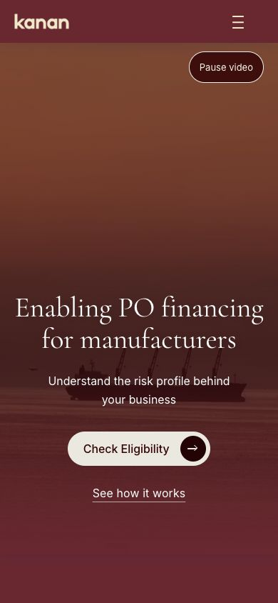
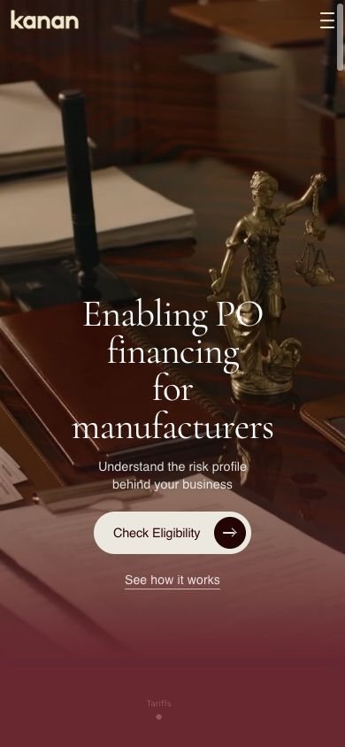

# Mobile homepage revision — implementation review

> Superseded by the [hierarchy correction](mobile-homepage-hierarchy-correction.md), following review feedback. The screenshots and specifications below document the rejected first revision, not the current preview.

Implemented 7 September 2026. The homepage now uses one compact layout system through 1023px, with phone arrangements through 767px. Existing copy variants, section order, images, destinations and application tracking parameters are preserved.

Local preview: [homepage](http://127.0.0.1:4180/). This serves the completed production build locally, not a deployment. Run `npm run preview` to rebuild and serve it on port 4180 in a subsequent session.

## Before and after

Both phone comparisons use a 390 × 844 CSS-pixel viewport. The roadmap is intentionally longer; this first-viewport comparison shows the change in reading density. Hero video frames differ because the video continues playing.

| Before | After |
| --- | --- |
|  |  |
|  |  |

Additional captures: [funnel](reviews/mobile-homepage/after-funnel-390.png), [manifesto and closing invitation](reviews/mobile-homepage/after-manifesto-390.png), [desktop roadmap before](reviews/mobile-homepage/before-roadmap-desktop.png), [desktop roadmap after](reviews/mobile-homepage/after-roadmap-desktop.png).

## What changed

- Shared mobile gutters, 64px act padding, 16px explanatory copy and a 13px supporting-text minimum replace independent component sizing. Headings use the agreed relative scale. Inter and Cormorant Garamond remain the typefaces.
- The hero uses its available width and grows with enlarged text. The video overlay protects text contrast. The mobile navigation has a solid, theme-matched reading surface and 44px targets.
- The workflow is a vertical sequence with HTML labels and animated paths. The roadmap has four content-sized stages on phones and growing rows on tablets.
- Audience comparisons are authored in HTML, immediately follow their mobile triggers, and switch without a blank intermediate state. The reel has a 1.5-second reading interval, 500ms movement and an eight-item disclosure.
- Funnel paragraphs remain readable throughout the cycle. Product cards enter individually over 450ms. The manifesto reveals three reading groups once, without re-blurring when scrolling back.
- Six labelled controls govern the video, workflow, reel, funnel and two moving grids. A shared lifecycle preserves explicit pauses across scrolling, background visibility and motion-preference changes. Menu Escape and focus-loop behaviour are included.

The implementation stays within the existing CSS, SVG, canvas and GSAP stack. There are no new dependencies, backend changes or public API changes.

## Verification

| Check | Result |
| --- | --- |
| Responsive layout | Passed at 320×568, 360×740, 390×844, 430×932, 844×390, 768×1024, 1023×768, 1280×900 and 1440×900. No horizontal document overflow or clipped text containers in the inspected content. [Recorded measurements](reviews/mobile-homepage/final-viewport-checks.json). |
| Type and spacing | Phone/tablet explanatory copy measures 16px; no rendered homepage text below 13px in the final phone scan. 200% root-font enlargement and the WCAG text-spacing overrides passed at 320px using temporary test fixtures. |
| Contrast | Computed mobile text-colour checks passed, excluding decorative separators and image/gradient surfaces from the automated calculation. Muted ink on cream is 6.16:1, muted cream on wine 7.46:1, and adjacent reel words at 80% opacity 5.77:1. The minimum hero overlay gives its large cream heading 4.25:1 even over a white video frame; white body text exceeds 4.5:1. Numerals over artwork have an opaque wine background. |
| Interactions and motion | Checked audience disclosure selection, keyboard arrows/Enter, menu activation/Escape/focus loop, reel disclosure, pause controls, resize and forward/reverse navigation. Revealed mobile manifesto words remain at full opacity with no blur. Explicit reel pause survives leaving and returning to the section. |
| Fallbacks | Script-free fixtures retain all three comparison groups, all eight capabilities, navigation and readable cards/manifesto. A missing-GSAP fixture retains an eight-link fallback menu. Missing video sources retain the poster and readable hero. A simulated reduced-motion preference produces static effects, hides motion controls and preserves an explicit pause after preference changes. |
| Desktop references | At 1440px, homepage act dimensions and audience card dimensions match the working-tree baseline. [Before geometry](reviews/mobile-homepage/desktop-before.json), [final geometry](reviews/mobile-homepage/desktop-final.json). Resources and Careers layouts remain unchanged in visual comparison; pixel differences occur in their moving effects. Their HTML/CSS are unchanged by this task. |
| Build and automated tests | `npm test`: **114 passed, 0 failed**. Four new lifecycle tests cover pause precedence, visibility suspension, reduced-motion transitions and playback retry. `npm run build`: **passed**; existing editorial takeaways-length warnings remain. |

Reference screenshots: [Resources before](reviews/mobile-homepage/resources-before-1440.png) / [after](reviews/mobile-homepage/resources-after-1440.png), [Careers before](reviews/mobile-homepage/careers-before-1440.png) / [after](reviews/mobile-homepage/careers-after-1440.png). The reference fixtures use identical generated content with the saved baseline versus current styles and scripts, so content changes do not distort the comparison.

These checks used the responsive desktop browser. Reduced motion was exercised through a test fixture and lifecycle tests, not a native phone setting. Physical touch hardware, native mobile browser controls, on-device screen-reader behaviour and a representative physical-phone scrolling profile remain to be checked. No measured performance improvement or full accessibility certification is claimed.

## Change boundaries

A copy and hash manifest of the working-tree homepage, component styles/scripts and reference pages were saved before editing. Comparison against that snapshot confirms changes to only these seven pre-existing files: `index.html`, `css/origin-cta.css`, `css/drona-brain.css`, `css/drona-funnel.css`, `css/triptych.css`, `css/sectors-bento.css` and `js/origin-cta.js`. Other pre-existing work was preserved.

New implementation files are [homepage-mobile.css](../css/homepage-mobile.css), [homepage.js](../js/homepage.js), [homepage-motion.js](../js/homepage-motion.js) and [homepage-motion.test.js](../test/homepage-motion.test.js). Legacy component mobile selectors exclude the revised homepage, making the new stylesheet its single compact-layout owner while retaining legacy behaviour elsewhere. Resources still executes its existing link-normalisation path in `origin-cta.js`.

The design choices follow the approved plan, informed by [USWDS typography](https://designsystem.digital.gov/components/typography/), [GOV.UK spacing](https://design-system.service.gov.uk/styles/spacing/) and W3C guidance on [reflow](https://www.w3.org/WAI/WCAG22/Understanding/reflow.html), [text spacing](https://www.w3.org/WAI/WCAG22/Understanding/text-spacing.html) and [pause controls](https://www.w3.org/WAI/WCAG22/Understanding/pause-stop-hide.html).
